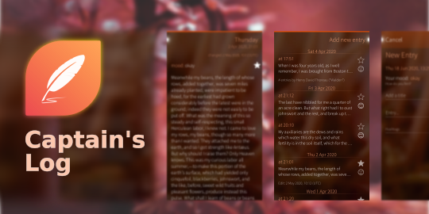

<!--
SPDX-FileCopyrightText: 2021-2023 Mirian Margiani
SPDX-License-Identifier: GFDL-1.3-or-later
-->

# Captain's Log for Sailfish OS

<!--  -->

Captain's Log is a simple diary application for keeping track of your thoughts.

This repository contains the development of version 2.0.0 and upwards of
Captain's Log. Previous versions were developed by the original author
[AlphaX2](https://github.com/AlphaX2/Captains-Log-Sailfish).

### Features

- lockscreen to restrict access
- bookmark entries
- add hashtags
- browse your entries by different filters
- export your data to different file formats

**Note:** Captain's Log can hide your entries behind a protection code but it's
nothing special. Your data is neither encrypted nor otherwise protected against
a bad guy with physical (or SSH) access to your device.

#### Planned features

- attach images to your entries
- include voice notes
- save and browse revisions after editing an entry
- improved translations
- improved export, if possible directly to PDF

### Permissions

Captain's Log requires the following permissions:

- Documents: required to export the database to different file formats

## Help and support

You are welcome to leave a comment on
[OpenRepos](https://openrepos.net/content/ichthyosaurus/captains-log-updated) or
in the Jolla store.

## Translations

It would be wonderful if the app could be translated in as many languages as possible!

Translations are managed using [Weblate](https://hosted.weblate.org/projects/harbour-captains-log/translations).
Please prefer this over pull request (which are still welcome, of course).
If you just found a minor problem, you can also
[leave a comment in the forum](https://forum.sailfishos.org/t/apps-by-ichthyosaurus/15753)
or [open an issue](https://github.com/ichthyosaurus/harbour-captains-log/issues/new).

Please include the following details:

1. the language you were using
2. where you found the error
3. the incorrect text
4. the correct translation

### Manually updating translations

You can follow these steps to manually add or update a translation:

1. *If it did not exists before*, create a new catalog for your language by copying the
   base file [translations/harbour-captains-log.ts](translations/harbour-captains-log.ts).
   Then add the new translation to [harbour-captains-log.pro](harbour-captains-log.pro).
2. Add yourself to the list of contributors in [qml/pages/AboutPage.qml](qml/pages/AboutPage.qml).

See [the Qt documentation](https://doc.qt.io/qt-5/qml-qtqml-date.html#details) for
details on how to translate date formats to your *local* format.

## Building and contributing

*Bug reports, and contributions for translations, bug fixes, or new features are always welcome!*

1. Clone the repository: `https://github.com/ichthyosaurus/harbour-captains-log.git`
2. Open `harbour-captains-log.pro` in Sailfish OS IDE (Qt Creator for Sailfish)
3. To run on emulator, select the `i486` target and press the run button
4. To build for the device, select the `armv7hl` target and deploy all,
   the RPM packages will be in the RPMS folder

Please do not forget to add yourself to the list of contributors in
[qml/pages/AboutPage.qml](qml/pages/AboutPage.qml)!

## License

> Copyright (C) 2020-2023  Mirian Margiani
>
> Copyright (C) 2020  AlphaX2

Captain's Log is Free Software released under the terms of the
[GNU General Public License v3 (or later)](https://spdx.org/licenses/GPL-3.0-or-later.html).
The source code is available [on Github](https://github.com/ichthyosaurus/harbour-captains-log).
Sources of legacy versions are also available [on Github](https://github.com/AlphaX2/Captains-Log-Sailfish).
All documentation is released under the terms of the
[GNU Free Documentation License v1.3 (or later)](https://spdx.org/licenses/GFDL-1.3-or-later.html).

This project follows the [REUSE specification](https://api.reuse.software/info/github.com/ichthyosaurus/harbour-captains-log).
